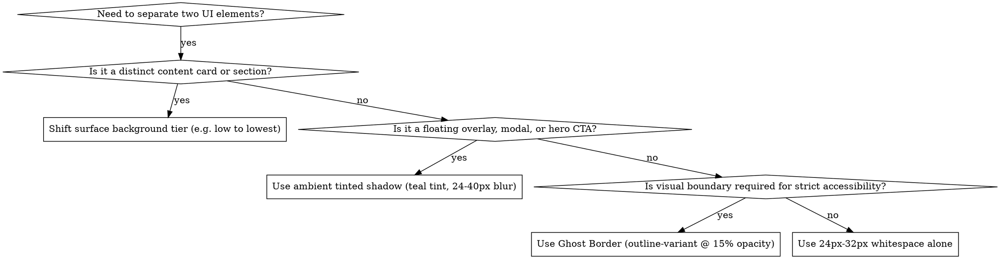

# Web Designer: The Serene Path

## Overview

The Serene Path translates Quitra's **"Digital Sanctuary"** philosophy into modern web interfaces. It rejects the sterile, high-stress visual language of clinical health apps in favor of a high-end wellness journal. The goal is to reduce cognitive friction and cortisol through expansive breathing room, organic depth, tonal layering, and authoritative editorial typography.

**Core Principle:** UI boundaries are shaped through tonal shifts and light—never through harsh 1px borders or dirty grey drop shadows.

## When to Use

Use this skill when:
- Creating or editing HTML, CSS, or web UI components for Quitra
- Implementing responsive web dashboards, landing pages, or web views
- Styling forms, buttons, cards, navigation, or progress indicators in web environments
- Evaluating or auditing web styling against `docs/DESIGN.md`

**When NOT to use:**
- For Flutter mobile widgets or Flutter themes (use `flutter_designer` instead)
- For backend logic or database schemas

## Depth & Separation Decision Flow



## Quick Reference: CSS Design Tokens

Place these custom properties in your root CSS stylesheet:

```css
:root {
  /* Surface Stack (Light) */
  --surface: #F9F9FF;
  --surface-container-low: #F1F3FF;
  --surface-container-high: #E1E8FD;
  --surface-container-lowest: #FFFFFF;

  /* Brand Teals */
  --primary: #005C55;
  --primary-container: #0F766E;
  --primary-gradient: linear-gradient(135deg, #005C55 0%, #0F766E 100%);
  --tertiary: #8F4C38; /* Warm terracotta for "Urge Defeated" / milestone moments */

  /* Typography Colors */
  --on-surface: #141B2B;         /* Primary text - NEVER use pure black */
  --on-surface-variant: #3E4947; /* Meta labels, captions */
  --outline-variant: rgba(62, 73, 71, 0.15); /* Ghost border fallback ONLY */

  /* Ambient Shadow (Mimics natural tinted light) */
  --shadow-ambient: 0 8px 40px rgba(0, 92, 85, 0.06);
  --shadow-ambient-lg: 0 16px 48px rgba(0, 92, 85, 0.08);

  /* Glassmorphism */
  --glass-bg: rgba(249, 249, 255, 0.80);
  --glass-blur: blur(16px);

  /* Radii */
  --radius-sm: 0.75rem; /* 12px */
  --radius-md: 1.5rem;  /* 24px */
  --radius-lg: 2.0rem;  /* 32px */
  --radius-pill: 9999px;

  /* Typography */
  --font-family: 'Manrope', -apple-system, BlinkMacSystemFont, 'Segoe UI', Roboto, sans-serif;
  --line-height-body: 1.6;
}
```

## Mandatory Rules & Patterns

### 1. The "No-Line" Rule
- **Prohibited:** Solid 1px borders (`border: 1px solid ...`) and `<hr>` divider lines for sectioning.
- **Enforced:** Separate cards and sections using background tier shifts (e.g. a pure white card `--surface-container-lowest` placed on `--surface-container-low`) or 24px–32px vertical whitespace.
- **Accessibility Fallback:** If high contrast outline is mandatory, use the **Ghost Border**: `border: 1px solid var(--outline-variant);` (15% opacity). Never use opaque 100% strokes.

### 2. Editorial Typography (Manrope)
- Always import and use Google Font `Manrope`: `<link href="https://fonts.googleapis.com/css2?family=Manrope:wght@400;500;600;700;800&display=swap" rel="stylesheet">`.
- **Display & Section Titles:** Tight letter-spacing (`letter-spacing: -0.02em; font-weight: 700;`).
- **Body Text:** Always set `line-height: 1.6;` to ensure low cognitive load during high-stress craving moments.
- **Color Discipline:** Always use `--on-surface` (`#141B2B`) for text. **Never use `#000000` or `#111111`**.

### 3. Component Architecture

#### Sanctuary Cards
- Always use rounded corners: `border-radius: var(--radius-md)` (24px) or `var(--radius-lg)` (32px).
- Base card: `background: var(--surface-container-lowest);`.
- Padding: Generous padding (24px to 32px). If it feels slightly tight, add 8px more.

#### Pill Buttons
- Primary CTA: Full pill radius (`border-radius: var(--radius-pill)`), signature teal gradient (`background: var(--primary-gradient)`), white text, no border.
- Secondary CTA: `background: var(--surface-container-low); color: var(--primary); border: none;`.
- Tertiary / Ghost: Pure text with `color: var(--primary)`, zero background, zero border.

#### Ambient Shadows
- Standard grey shadows look like dirt on a screen.
- Floating elements must use teal-tinted ambient shadows: `box-shadow: 0 8px 40px rgba(0, 92, 85, 0.06);`.

#### Glassmorphic Overlays
- Floating headers, floating navigation, or craving drawers:
  ```css
  background: var(--glass-bg);
  backdrop-filter: var(--glass-blur);
  -webkit-backdrop-filter: var(--glass-blur);
  border-bottom: 1px solid var(--outline-variant);
  ```

#### Form Controls
- Inputs: `background: var(--surface-container-high); border: none; border-radius: var(--radius-sm); padding: 14px 18px; color: var(--on-surface);`.
- Focus state: `background: var(--surface-container-lowest); outline: 2px solid rgba(0, 92, 85, 0.25);`.

### 4. Real Screenshots & Asset Discipline
- **Prohibited:** AI-generated UI mockups, synthetic phone renders, or generic placeholder images for product previews.
- **Enforced:** Capture and embed REAL screenshots directly from the working Quitra application.
- **Capture Method:** Run the actual application (or automated headless flow) to capture genuine UI states. Use Playwright only when automated browser capture is needed. Real product fidelity builds genuine user trust.

## Canonical Web Implementation

```html
<!DOCTYPE html>
<html lang="en">
<head>
  <meta charset="UTF-8">
  <meta name="viewport" content="width=device-width, initial-scale=1.0">
  <title>The Serene Path - Quitra Component</title>
  <link rel="preconnect" href="https://fonts.googleapis.com">
  <link rel="preconnect" href="https://fonts.gstatic.com" crossorigin>
  <link href="https://fonts.googleapis.com/css2?family=Manrope:wght@400;500;600;700;800&display=swap" rel="stylesheet">
  <style>
    :root {
      --surface: #F9F9FF;
      --surface-container-low: #F1F3FF;
      --surface-container-lowest: #FFFFFF;
      --primary: #005C55;
      --primary-container: #0F766E;
      --primary-gradient: linear-gradient(135deg, #005C55 0%, #0F766E 100%);
      --on-surface: #141B2B;
      --on-surface-variant: #3E4947;
      --outline-variant: rgba(62, 73, 71, 0.15);
      --shadow-ambient: 0 8px 40px rgba(0, 92, 85, 0.06);
      --radius-md: 1.5rem;
      --radius-pill: 9999px;
      --font-family: 'Manrope', sans-serif;
    }

    body {
      margin: 0;
      padding: 48px 24px;
      background-color: var(--surface);
      font-family: var(--font-family);
      color: var(--on-surface);
      line-height: 1.6;
    }

    .sanctuary-card {
      max-width: 480px;
      margin: 0 auto;
      background: var(--surface-container-lowest);
      border-radius: var(--radius-md);
      padding: 32px;
      box-shadow: var(--shadow-ambient);
    }

    .editorial-header {
      display: flex;
      justify-content: space-between;
      align-items: baseline;
      margin-bottom: 24px;
    }

    .title {
      font-size: 1.75rem;
      font-weight: 800;
      letter-spacing: -0.02em;
      margin: 0;
      color: var(--on-surface);
    }

    .meta-tag {
      font-size: 0.875rem;
      font-weight: 600;
      color: var(--on-surface-variant);
      text-transform: uppercase;
      letter-spacing: 0.05em;
    }

    .stat-hero {
      background: var(--surface-container-low);
      border-radius: 1rem;
      padding: 24px;
      margin-bottom: 24px;
      display: flex;
      justify-content: space-between;
      align-items: center;
    }

    .stat-number {
      font-size: 2.25rem;
      font-weight: 800;
      color: var(--primary);
      letter-spacing: -0.02em;
      line-height: 1;
    }

    .btn-pill {
      display: inline-flex;
      align-items: center;
      justify-content: center;
      width: 100%;
      padding: 16px 28px;
      border-radius: var(--radius-pill);
      background: var(--primary-gradient);
      color: #FFFFFF;
      font-size: 1rem;
      font-weight: 700;
      text-decoration: none;
      border: none;
      cursor: pointer;
      box-shadow: 0 4px 16px rgba(0, 92, 85, 0.2);
      transition: transform 0.15s ease;
    }

    .btn-pill:active {
      transform: scale(0.98);
    }
  </style>
</head>
<body>
  <div class="sanctuary-card">
    <div class="editorial-header">
      <h2 class="title">Smoke-Free Sanctuary</h2>
      <span class="meta-tag">Day 14</span>
    </div>
    <div class="stat-hero">
      <div>
        <div style="font-weight: 600; font-size: 0.95rem;">Cravings Overcome</div>
        <div style="color: var(--on-surface-variant); font-size: 0.85rem;">Deep breaths taken</div>
      </div>
      <div class="stat-number">42</div>
    </div>
    <button class="btn-pill">I Feel a Craving</button>
  </div>
</body>
</html>
```

## Rationalization Table

| Excuse | Reality | The Serene Path Fix |
|--------|---------|---------------------|
| "1px borders make cards easier to distinguish" | Hard borders create cognitive clutter and 'visual fences', spiking anxiety. | Remove the border. Place a pure white (`--surface-container-lowest`) card on a tinted background (`--surface-container-low`). |
| "A grey box shadow `0 2px 4px rgba(0,0,0,0.1)` is subtle enough" | Black/grey shadows simulate artificial grey dirt. | Use tinted ambient light: `rgba(0, 92, 85, 0.06)` with 24px–40px blur radius. |
| "Dividers `<hr>` are the cleanest way to separate list items" | Lines slice up the content and feel like an administrative form. | Use 24px–32px vertical whitespace or subtle alternating surface colors. |
| "Pure black `#000000` text gives maximum readability" | Pure black on bright backgrounds causes high ocular fatigue and visual harshness. | Always use `--on-surface` (`#141B2B`). |
| "System sans-serif font is fine for mockups" | Standard system fonts look generic and clinical, breaking the journal aesthetic. | Always import and declare `Manrope` with `-0.02em` letter-spacing on headlines. |
| "Square or 4px rounded buttons feel modern and professional" | Sharp corners convey clinical tension. | Use full pill `border-radius: 9999px` for buttons and `1.5rem`–`2.0rem` for cards. |
| "AI mockups or generated images look cleaner than real screenshots" | Synthetic images hallucinate fake features, look generic, and destroy user trust. | Capture real screenshots of the running Quitra application (use Playwright if automation is needed). |

## Red Flags - STOP and Fix

- Any occurrence of `border: 1px solid #...` without the 15% opacity ghost border constraint
- `<hr>` elements or divider strokes
- `color: #000000` or `color: black`
- `box-shadow` using black/grey alphas (`rgba(0,0,0,...)`)
- Buttons without `border-radius: 9999px`
- Cards with sharp corners (`border-radius: 0px` to `8px`)
- Any missing `Manrope` font import in web templates
- Cramped layouts with `< 16px` padding between sections (always add 8px more)
- Using AI image generators (e.g. `generate_image`) or synthetic placeholder mockups for app screenshots instead of real application captures

## Common Mistakes & Solutions

1. **Mistake:** Using flat hex teal (`#005C55`) for the primary action button.  
   **Fix:** Use the signature gradient `linear-gradient(135deg, #005C55 0%, #0F766E 100%)` to inject warmth and depth.

2. **Mistake:** Setting backdrop-filter without vendor prefix or fallback background.  
   **Fix:** Include `-webkit-backdrop-filter: blur(16px); backdrop-filter: blur(16px);` and supply `rgba(249, 249, 255, 0.80)`.

3. **Mistake:** Designing symmetric, rigid grid boxes that resemble an analytics dashboard.  
   **Fix:** Embrace editorial asymmetry—align section headlines on the left and supporting statistics on the right at different vertical heights.
