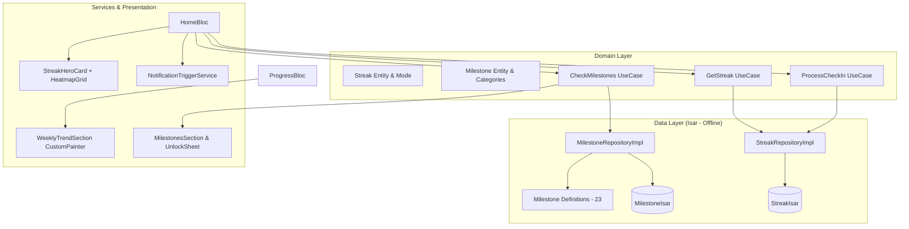

# Quitra Retention Overhaul — Implementation Plan

> **For agentic workers:** REQUIRED SUB-SKILL: Use superpowers:subagent-driven-development to implement this plan task-by-task. Steps use checkbox (`- [ ]`) syntax for tracking.

**Goal:** Implement 6 interconnected retention and engagement features in Quitra (Streak System, Home Page Redesign with 12-week Heatmap, Milestones & Celebrations, Smart Contextual Notifications, Targeted State Animations, and Progress Page Improvements with Weekly Craving Trends) adhering strictly to The Serene Path design system and offline Clean Architecture.

**Architecture:** A domain-driven, feature-first Clean Architecture where local persistence is handled entirely via Isar. New domain modules (`streak`, `milestones`) provide entities, repositories, and use cases that feed `HomeBloc`, `ProgressBloc`, and `SettingsBloc`. Presentations adhere to "The Serene Path" (no lines/borders, tonal layering, soft shadows, 24px corner radii, and compassionate brand tone).

**Architecture Diagram:**



**Tech Stack:** Flutter 3.9+ / Dart 3.13+, `flutter_bloc`, `freezed`, `injectable` / `get_it`, `isar` 3.1+, `flutter_local_notifications`, `mocktail` for testing, `flutter_test`.

**Spec:** [docs/superpowers/specs/2026-10-02-retention-overhaul-design.md](file:///Users/ahmedsal/workspace/quitra/docs/superpowers/specs/2026-10-02-retention-overhaul-design.md)

---

## Global Constraints

- **Strictly Offline:** Zero network requests; all state persists in local Isar collections.
- **The Serene Path:** Follow [DESIGN.md](file:///Users/ahmedsal/workspace/quitra/docs/DESIGN.md) — 24px radius, no stroke borders (`Border.all`), surface container layering, teal brand palette (`#005C55`), soft green (`#22C55E`), warm terracotta (`#E57373`).
- **Brand Voice:** Follow [brand.md](file:///Users/ahmedsal/workspace/quitra/docs/brand.md) — "Setback" not "Relapse", "Moments" not "Cravings", non-judgmental compassionate copy.
- **Dynamic Computations:** Always compute financial savings dynamically from user profile (`cigarettePrice`), never hardcoded defaults.
- **No External Chart or Animation Packages:** Built-in Flutter `CustomPainter`, `AnimationController`, `TweenAnimationBuilder` only.
- **Localization:** All user-facing strings must have entries in both [lib/l10n/app_en.arb](file:///Users/ahmedsal/workspace/quitra/lib/l10n/app_en.arb) and [lib/l10n/app_ar.arb](file:///Users/ahmedsal/workspace/quitra/lib/l10n/app_ar.arb).
- **Code Generation:** Run `dart run build_runner build --delete-conflicting-outputs` after adding/modifying Freezed, Injectable, or Isar files.

---

### Task 1: Streak Domain Layer

**Files:**
- Create: `lib/features/streak/domain/entities/streak.dart`
- Create: `lib/features/streak/domain/repositories/streak_repository.dart`
- Create: `lib/features/streak/domain/usecases/get_streak.dart`
- Create: `lib/features/streak/domain/usecases/increment_streak.dart`
- Create: `lib/features/streak/domain/usecases/reset_streak.dart`
- Create: `lib/features/streak/domain/usecases/update_streak_mode.dart`
- Create: `lib/features/streak/domain/usecases/use_forgiveness_token.dart`
- Test: `test/features/streak/domain/entities/streak_test.dart`

**Interfaces:**
- Consumes: `core/error/failures.dart`
- Produces: `Streak` entity, `StreakMode` enum, `StreakRepository` interface, use case classes (`GetStreak`, `IncrementStreak`, `ResetStreak`, `UpdateStreakMode`, `UseForgivenessToken`).

- [ ] **Step 1: Write the failing unit test for Streak entity**

Create `test/features/streak/domain/entities/streak_test.dart`:
```dart
import 'package:flutter_test/flutter_test.dart';
import 'package:quitra/features/streak/domain/entities/streak.dart';

void main() {
  group('Streak Entity', () {
    test('supports value equality and default values', () {
      final now = DateTime(2026, 10, 2);
      final streak1 = Streak(
        currentCount: 5,
        longestCount: 10,
        lastCheckInDate: now,
        mode: StreakMode.strict,
        forgivenessUsedThisWeek: false,
      );

      final streak2 = Streak(
        currentCount: 5,
        longestCount: 10,
        lastCheckInDate: now,
        mode: StreakMode.strict,
        forgivenessUsedThisWeek: false,
      );

      expect(streak1, equals(streak2));
      expect(streak1.currentCount, 5);
      expect(streak1.mode, StreakMode.strict);
    });
  });
}
```

- [ ] **Step 2: Run test to verify it fails**

Run: `flutter test test/features/streak/domain/entities/streak_test.dart`
Expected: FAIL with compilation error (file not found).

- [ ] **Step 3: Implement Streak Entity and Use Cases**

Create `lib/features/streak/domain/entities/streak.dart`:
```dart
import 'package:freezed_annotation/freezed_annotation.dart';

part 'streak.freezed.dart';

enum StreakMode { strict, forgiving }

@freezed
abstract class Streak with _$Streak {
  const factory Streak({
    required int currentCount,
    required int longestCount,
    required DateTime? lastCheckInDate,
    required StreakMode mode,
    @Default(false) bool forgivenessUsedThisWeek,
  }) = _Streak;
}
```

Create `lib/features/streak/domain/repositories/streak_repository.dart`:
```dart
import 'package:dartz/dartz.dart';
import '../../../../core/error/failures.dart';
import '../entities/streak.dart';

abstract class StreakRepository {
  Future<Either<Failure, Streak>> getStreak();
  Future<Either<Failure, Streak>> incrementStreak();
  Future<Either<Failure, Streak>> resetStreak();
  Future<Either<Failure, Streak>> updateStreakMode(StreakMode mode);
  Future<Either<Failure, Streak>> useForgivenessToken();
}
```

Create `lib/features/streak/domain/usecases/get_streak.dart`:
```dart
import 'package:dartz/dartz.dart';
import 'package:injectable/injectable.dart';
import '../../../../core/error/failures.dart';
import '../entities/streak.dart';
import '../repositories/streak_repository.dart';

@lazySingleton
class GetStreak {
  final StreakRepository repository;
  GetStreak(this.repository);

  Future<Either<Failure, Streak>> call() => repository.getStreak();
}
```

Create `lib/features/streak/domain/usecases/increment_streak.dart`:
```dart
import 'package:dartz/dartz.dart';
import 'package:injectable/injectable.dart';
import '../../../../core/error/failures.dart';
import '../entities/streak.dart';
import '../repositories/streak_repository.dart';

@lazySingleton
class IncrementStreak {
  final StreakRepository repository;
  IncrementStreak(this.repository);

  Future<Either<Failure, Streak>> call() => repository.incrementStreak();
}
```

Create `lib/features/streak/domain/usecases/reset_streak.dart`:
```dart
import 'package:dartz/dartz.dart';
import 'package:injectable/injectable.dart';
import '../../../../core/error/failures.dart';
import '../entities/streak.dart';
import '../repositories/streak_repository.dart';

@lazySingleton
class ResetStreak {
  final StreakRepository repository;
  ResetStreak(this.repository);

  Future<Either<Failure, Streak>> call() => repository.resetStreak();
}
```

Create `lib/features/streak/domain/usecases/update_streak_mode.dart`:
```dart
import 'package:dartz/dartz.dart';
import 'package:injectable/injectable.dart';
import '../../../../core/error/failures.dart';
import '../entities/streak.dart';
import '../repositories/streak_repository.dart';

@lazySingleton
class UpdateStreakMode {
  final StreakRepository repository;
  UpdateStreakMode(this.repository);

  Future<Either<Failure, Streak>> call(StreakMode mode) => repository.updateStreakMode(mode);
}
```

Create `lib/features/streak/domain/usecases/use_forgiveness_token.dart`:
```dart
import 'package:dartz/dartz.dart';
import 'package:injectable/injectable.dart';
import '../../../../core/error/failures.dart';
import '../entities/streak.dart';
import '../repositories/streak_repository.dart';

@lazySingleton
class UseForgivenessToken {
  final StreakRepository repository;
  UseForgivenessToken(this.repository);

  Future<Either<Failure, Streak>> call() => repository.useForgivenessToken();
}
```

Run code generator:
`dart run build_runner build --delete-conflicting-outputs`

- [ ] **Step 4: Run test to verify it passes**

Run: `flutter test test/features/streak/domain/entities/streak_test.dart`
Expected: PASS.

- [ ] **Step 5: Commit**

```bash
git add lib/features/streak/domain/ test/features/streak/domain/
git commit -m "feat(streak): add streak domain layer entities, repository, and use cases"
```

---

### Task 2: Streak Data Layer (Isar Model, DataSource, Repository)

**Files:**
- Create: `lib/features/streak/data/models/streak_isar.dart`
- Create: `lib/features/streak/data/datasources/streak_local_data_source.dart`
- Create: `lib/features/streak/data/repositories/streak_repository_impl.dart`
- Modify: `lib/core/di/injection.dart:22-31`
- Test: `test/features/streak/data/repositories/streak_repository_impl_test.dart`

**Interfaces:**
- Consumes: `StreakRepository`, `Streak`, `StreakMode`, `Isar`
- Produces: `StreakIsar` schema, `StreakLocalDataSource`, `StreakRepositoryImpl` registered in DI.

- [ ] **Step 1: Write test for StreakRepositoryImpl**

Create `test/features/streak/data/repositories/streak_repository_impl_test.dart`:
```dart
import 'package:flutter_test/flutter_test.dart';
import 'package:mocktail/mocktail.dart';
import 'package:quitra/features/streak/data/datasources/streak_local_data_source.dart';
import 'package:quitra/features/streak/data/models/streak_isar.dart';
import 'package:quitra/features/streak/data/repositories/streak_repository_impl.dart';
import 'package:quitra/features/streak/domain/entities/streak.dart';

class MockStreakLocalDataSource extends Mock implements StreakLocalDataSource {}

void main() {
  late StreakRepositoryImpl repository;
  late MockStreakLocalDataSource mockDataSource;

  setUp(() {
    mockDataSource = MockStreakLocalDataSource();
    repository = StreakRepositoryImpl(mockDataSource);
  });

  test('getStreak returns default streak if none stored', () async {
    when(() => mockDataSource.getStreakModel()).thenAnswer((_) async => null);
    when(() => mockDataSource.saveStreakModel(any())).thenAnswer((_) async {});

    final result = await repository.getStreak();

    expect(result.isRight(), isTrue);
    result.fold(
      (_) => fail('should succeed'),
      (streak) {
        expect(streak.currentCount, 0);
        expect(streak.mode, StreakMode.strict);
      },
    );
  });

  test('incrementStreak increases current count and updates longestCount', () async {
    final model = StreakIsar()
      ..currentCount = 4
      ..longestCount = 4
      ..modeIndex = StreakMode.strict.index;

    when(() => mockDataSource.getStreakModel()).thenAnswer((_) async => model);
    when(() => mockDataSource.saveStreakModel(any())).thenAnswer((_) async {});

    final result = await repository.incrementStreak();

    expect(result.isRight(), isTrue);
    result.fold(
      (_) => fail('should succeed'),
      (streak) {
        expect(streak.currentCount, 5);
        expect(streak.longestCount, 5);
      },
    );
  });
}
```

- [ ] **Step 2: Run test to verify it fails**

Run: `flutter test test/features/streak/data/repositories/streak_repository_impl_test.dart`
Expected: FAIL with compilation error (missing model and datasource).

- [ ] **Step 3: Implement Isar model, DataSource, Repository, and register DI**

Create `lib/features/streak/data/models/streak_isar.dart`:
```dart
import 'package:isar/isar.dart';

part 'streak_isar.g.dart';

@collection
class StreakIsar {
  Id id = 0;

  int currentCount = 0;
  int longestCount = 0;
  DateTime? lastCheckInDate;
  int modeIndex = 0; // 0: strict, 1: forgiving
  bool forgivenessUsedThisWeek = false;
  DateTime? weekStartDate;
}
```

Create `lib/features/streak/data/datasources/streak_local_data_source.dart`:
```dart
import 'package:injectable/injectable.dart';
import 'package:isar/isar.dart';
import '../models/streak_isar.dart';

abstract class StreakLocalDataSource {
  Future<StreakIsar?> getStreakModel();
  Future<void> saveStreakModel(StreakIsar model);
}

@LazySingleton(as: StreakLocalDataSource)
class StreakLocalDataSourceImpl implements StreakLocalDataSource {
  final Isar isar;
  StreakLocalDataSourceImpl(this.isar);

  @override
  Future<StreakIsar?> getStreakModel() async {
    return isar.streakIsars.get(0);
  }

  @override
  Future<void> saveStreakModel(StreakIsar model) async {
    model.id = 0;
    await isar.writeTxn(() async {
      await isar.streakIsars.put(model);
    });
  }
}
```

Create `lib/features/streak/data/repositories/streak_repository_impl.dart`:
```dart
import 'package:dartz/dartz.dart';
import 'package:injectable/injectable.dart';
import '../../../../core/error/failures.dart';
import '../../domain/entities/streak.dart';
import '../../domain/repositories/streak_repository.dart';
import '../datasources/streak_local_data_source.dart';
import '../models/streak_isar.dart';

@LazySingleton(as: StreakRepository)
class StreakRepositoryImpl implements StreakRepository {
  final StreakLocalDataSource localDataSource;

  StreakRepositoryImpl(this.localDataSource);

  DateTime _getMondayOfCurrentWeek(DateTime date) {
    return DateTime(date.year, date.month, date.day).subtract(Duration(days: date.weekday - 1));
  }

  Streak _toEntity(StreakIsar model) {
    final now = DateTime.now();
    final currentWeekStart = _getMondayOfCurrentWeek(now);
    
    bool forgivenessUsed = model.forgivenessUsedThisWeek;
    if (model.weekStartDate != null && model.weekStartDate!.isBefore(currentWeekStart)) {
      forgivenessUsed = false;
    }

    return Streak(
      currentCount: model.currentCount,
      longestCount: model.longestCount,
      lastCheckInDate: model.lastCheckInDate,
      mode: StreakMode.values[model.modeIndex],
      forgivenessUsedThisWeek: forgivenessUsed,
    );
  }

  Future<StreakIsar> _getOrCreate() async {
    final existing = await localDataSource.getStreakModel();
    if (existing != null) {
      final now = DateTime.now();
      final currentWeekStart = _getMondayOfCurrentWeek(now);
      if (existing.weekStartDate == null || existing.weekStartDate!.isBefore(currentWeekStart)) {
        existing.forgivenessUsedThisWeek = false;
        existing.weekStartDate = currentWeekStart;
        await localDataSource.saveStreakModel(existing);
      }
      return existing;
    }
    final initial = StreakIsar()
      ..currentCount = 0
      ..longestCount = 0
      ..modeIndex = 0
      ..forgivenessUsedThisWeek = false
      ..weekStartDate = _getMondayOfCurrentWeek(DateTime.now());
    await localDataSource.saveStreakModel(initial);
    return initial;
  }

  @override
  Future<Either<Failure, Streak>> getStreak() async {
    try {
      final model = await _getOrCreate();
      return Right(_toEntity(model));
    } catch (_) {
      return const Left(Failure.databaseError());
    }
  }

  @override
  Future<Either<Failure, Streak>> incrementStreak() async {
    try {
      final model = await _getOrCreate();
      model.currentCount += 1;
      if (model.currentCount > model.longestCount) {
        model.longestCount = model.currentCount;
      }
      model.lastCheckInDate = DateTime.now();
      await localDataSource.saveStreakModel(model);
      return Right(_toEntity(model));
    } catch (_) {
      return const Left(Failure.databaseError());
    }
  }

  @override
  Future<Either<Failure, Streak>> resetStreak() async {
    try {
      final model = await _getOrCreate();
      model.currentCount = 0;
      model.lastCheckInDate = DateTime.now();
      await localDataSource.saveStreakModel(model);
      return Right(_toEntity(model));
    } catch (_) {
      return const Left(Failure.databaseError());
    }
  }

  @override
  Future<Either<Failure, Streak>> updateStreakMode(StreakMode mode) async {
    try {
      final model = await _getOrCreate();
      model.modeIndex = mode.index;
      await localDataSource.saveStreakModel(model);
      return Right(_toEntity(model));
    } catch (_) {
      return const Left(Failure.databaseError());
    }
  }

  @override
  Future<Either<Failure, Streak>> useForgivenessToken() async {
    try {
      final model = await _getOrCreate();
      model.forgivenessUsedThisWeek = true;
      model.lastCheckInDate = DateTime.now();
      await localDataSource.saveStreakModel(model);
      return Right(_toEntity(model));
    } catch (_) {
      return const Left(Failure.databaseError());
    }
  }
}
```

Update [lib/core/di/injection.dart](file:///Users/ahmedsal/workspace/quitra/lib/core/di/injection.dart):
Add `StreakIsarSchema` to `Isar.open` schema list.

Register test fallback and run code generation:
`dart run build_runner build --delete-conflicting-outputs`

- [ ] **Step 4: Run test to verify it passes**

Run: `flutter test test/features/streak/data/repositories/streak_repository_impl_test.dart`
Expected: PASS.

- [ ] **Step 5: Commit**

```bash
git add lib/features/streak/data/ lib/core/di/ test/features/streak/data/
git commit -m "feat(streak): add Isar model, local datasource, and repository implementation"
```

---

### Task 3: ProcessCheckIn Orchestrator Use Case

**Files:**
- Create: `lib/features/streak/domain/usecases/process_check_in.dart`
- Test: `test/features/streak/domain/usecases/process_check_in_test.dart`

**Interfaces:**
- Consumes: `StreakRepository`, `GetStreak`, `IncrementStreak`, `ResetStreak`, `UseForgivenessToken`
- Produces: `ProcessCheckIn` use case returning `Future<Either<Failure, ProcessCheckInResult>>` with `(Streak updatedStreak, bool wasForgiven)`.

- [ ] **Step 1: Write test for ProcessCheckIn**

Create `test/features/streak/domain/usecases/process_check_in_test.dart`:
```dart
import 'package:dartz/dartz.dart';
import 'package:flutter_test/flutter_test.dart';
import 'package:mocktail/mocktail.dart';
import 'package:quitra/features/streak/domain/entities/streak.dart';
import 'package:quitra/features/streak/domain/repositories/streak_repository.dart';
import 'package:quitra/features/streak/domain/usecases/process_check_in.dart';

class MockStreakRepository extends Mock implements StreakRepository {}

void main() {
  late MockStreakRepository repository;
  late ProcessCheckIn useCase;

  setUp(() {
    repository = MockStreakRepository();
    useCase = ProcessCheckIn(repository);
  });

  test('increments streak when smokeFree is true', () async {
    const streak = Streak(
      currentCount: 2,
      longestCount: 2,
      lastCheckInDate: null,
      mode: StreakMode.strict,
    );
    when(() => repository.incrementStreak()).thenAnswer((_) async => const Right(streak));

    final result = await useCase(wasSmoked: false);

    expect(result.isRight(), isTrue);
    result.fold(
      (_) => fail('should succeed'),
      (res) {
        expect(res.streak.currentCount, 2);
        expect(res.wasForgiven, isFalse);
      },
    );
    verify(() => repository.incrementStreak()).called(1);
    verifyNever(() => repository.resetStreak());
  });

  test('strict mode resets streak when smoked', () async {
    const streak = Streak(
      currentCount: 5,
      longestCount: 5,
      lastCheckInDate: null,
      mode: StreakMode.strict,
    );
    const resetStreak = Streak(
      currentCount: 0,
      longestCount: 5,
      lastCheckInDate: null,
      mode: StreakMode.strict,
    );
    when(() => repository.getStreak()).thenAnswer((_) async => const Right(streak));
    when(() => repository.resetStreak()).thenAnswer((_) async => const Right(resetStreak));

    final result = await useCase(wasSmoked: true);

    expect(result.isRight(), isTrue);
    result.fold(
      (_) => fail('should succeed'),
      (res) {
        expect(res.streak.currentCount, 0);
        expect(res.wasForgiven, isFalse);
      },
    );
    verify(() => repository.resetStreak()).called(1);
  });

  test('forgiving mode uses forgiveness token on first setback of the week', () async {
    const streak = Streak(
      currentCount: 5,
      longestCount: 5,
      lastCheckInDate: null,
      mode: StreakMode.forgiving,
      forgivenessUsedThisWeek: false,
    );
    const forgivenStreak = Streak(
      currentCount: 5,
      longestCount: 5,
      lastCheckInDate: null,
      mode: StreakMode.forgiving,
      forgivenessUsedThisWeek: true,
    );
    when(() => repository.getStreak()).thenAnswer((_) async => const Right(streak));
    when(() => repository.useForgivenessToken()).thenAnswer((_) async => const Right(forgivenStreak));

    final result = await useCase(wasSmoked: true);

    expect(result.isRight(), isTrue);
    result.fold(
      (_) => fail('should succeed'),
      (res) {
        expect(res.streak.currentCount, 5);
        expect(res.wasForgiven, isTrue);
      },
    );
    verify(() => repository.useForgivenessToken()).called(1);
    verifyNever(() => repository.resetStreak());
  });
}
```

- [ ] **Step 2: Run test to verify it fails**

Run: `flutter test test/features/streak/domain/usecases/process_check_in_test.dart`
Expected: FAIL with compilation error (class not found).

- [ ] **Step 3: Implement ProcessCheckIn use case**

Create `lib/features/streak/domain/usecases/process_check_in.dart`:
```dart
import 'package:dartz/dartz.dart';
import 'package:injectable/injectable.dart';
import '../../../../core/error/failures.dart';
import '../entities/streak.dart';
import '../repositories/streak_repository.dart';

class ProcessCheckInResult {
  final Streak streak;
  final bool wasForgiven;

  const ProcessCheckInResult({
    required this.streak,
    required this.wasForgiven,
  });
}

@lazySingleton
class ProcessCheckIn {
  final StreakRepository repository;

  ProcessCheckIn(this.repository);

  Future<Either<Failure, ProcessCheckInResult>> call({required bool wasSmoked}) async {
    if (!wasSmoked) {
      final incResult = await repository.incrementStreak();
      return incResult.map((streak) => ProcessCheckInResult(streak: streak, wasForgiven: false));
    }

    final currentResult = await repository.getStreak();
    return currentResult.bind((current) async {
      if (current.mode == StreakMode.forgiving && !current.forgivenessUsedThisWeek) {
        final forgiveResult = await repository.useForgivenessToken();
        return forgiveResult.map((streak) => ProcessCheckInResult(streak: streak, wasForgiven: true));
      } else {
        final resetResult = await repository.resetStreak();
        return resetResult.map((streak) => ProcessCheckInResult(streak: streak, wasForgiven: false));
      }
    });
  }
}
```

Run code generator:
`dart run build_runner build --delete-conflicting-outputs`

- [ ] **Step 4: Run test to verify it passes**

Run: `flutter test test/features/streak/domain/usecases/process_check_in_test.dart`
Expected: PASS.

- [ ] **Step 5: Commit**

```bash
git add lib/features/streak/domain/usecases/process_check_in.dart test/features/streak/domain/usecases/process_check_in_test.dart
git commit -m "feat(streak): add ProcessCheckIn orchestrator use case"
```

---

### Task 4: HomeBloc & State Update with Streak Support

**Files:**
- Modify: `lib/features/home/presentation/bloc/home_state.dart:6-12`
- Modify: `lib/features/home/presentation/bloc/home_bloc.dart:10-64`
- Test: `test/features/home/presentation/bloc/home_bloc_test.dart`

**Interfaces:**
- Consumes: `GetStreak`, `ProcessCheckIn`, `GetHomeStatsUseCase`, `LogCravingUseCase`, `SaveDailyLog`
- Produces: `HomeState.loaded(UserStats stats, Streak streak)`

- [ ] **Step 1: Write test for updated HomeBloc**

Create `test/features/home/presentation/bloc/home_bloc_test.dart`.

- [ ] **Step 2: Run test to verify it fails**

Run: `flutter test test/features/home/presentation/bloc/home_bloc_test.dart`
Expected: FAIL due to constructor signature and state mismatch.

- [ ] **Step 3: Update HomeState and HomeBloc**

Update `HomeState` to include `required Streak streak` in `Loaded` state.
Update `HomeBloc` to inject `GetStreak` and `ProcessCheckIn` and dispatch them on stats loading and check-ins.
Run code generator:
`dart run build_runner build --delete-conflicting-outputs`

- [ ] **Step 4: Run test to verify it passes**

Run: `flutter test test/features/home/presentation/bloc/home_bloc_test.dart`
Expected: PASS.

- [ ] **Step 5: Commit**

```bash
git add lib/features/home/presentation/bloc/ test/features/home/presentation/bloc/
git commit -m "feat(home): update HomeBloc and HomeState with Streak integration"
```

---

### Task 5: HeatmapGrid & StreakHeroCard Widgets

**Files:**
- Create: `lib/features/home/presentation/widgets/heatmap_grid.dart`
- Create: `lib/features/home/presentation/widgets/streak_hero_card.dart`
- Delete: `lib/features/home/presentation/widgets/home_stats_bar.dart`
- Modify: `lib/features/home/presentation/pages/home_page.dart:1-44`
- Test: `test/features/home/presentation/widgets/heatmap_grid_test.dart`

**Interfaces:**
- Consumes: `Streak`, `UserStats`, `JourneyDay` history, `AppTheme`
- Produces: `HeatmapGrid` widget, `StreakHeroCard` widget.

- [ ] **Step 1: Write test for HeatmapGrid**

Create `test/features/home/presentation/widgets/heatmap_grid_test.dart`.

- [ ] **Step 2: Run test to verify it fails**

Run: `flutter test test/features/home/presentation/widgets/heatmap_grid_test.dart`
Expected: FAIL.

- [ ] **Step 3: Implement HeatmapGrid, StreakHeroCard, and update HomePage**

Implement 12-week GitHub-style grid and hero card combining streak counter, grid, and quick stats.
Update `HomePage` to mount `StreakHeroCard` and remove `HomeStatsBar`.

- [ ] **Step 4: Run test to verify it passes**

Run: `flutter test test/features/home/presentation/widgets/heatmap_grid_test.dart`
Expected: PASS.

- [ ] **Step 5: Commit**

```bash
git add lib/features/home/ test/features/home/
git commit -m "feat(home): introduce StreakHeroCard with 12-week HeatmapGrid and replace HomeStatsBar"
```

---

### Task 6: Milestones Domain & Data Layer

**Files:**
- Create: `lib/features/milestones/domain/entities/milestone.dart`
- Create: `lib/features/milestones/domain/repositories/milestone_repository.dart`
- Create: `lib/features/milestones/data/milestone_definitions.dart`
- Create: `lib/features/milestones/data/models/milestone_isar.dart`
- Create: `lib/features/milestones/data/datasources/milestone_local_data_source.dart`
- Create: `lib/features/milestones/data/repositories/milestone_repository_impl.dart`
- Modify: `lib/core/di/injection.dart:22-35`
- Test: `test/features/milestones/data/repositories/milestone_repository_impl_test.dart`

**Interfaces:**
- Consumes: `Isar`, `Failure`
- Produces: `Milestone`, `MilestoneCategory`, `MilestoneRepository`, `predefinedMilestones` list of 23 milestones.

- [ ] **Step 1: Write test for MilestoneRepositoryImpl**

Create `test/features/milestones/data/repositories/milestone_repository_impl_test.dart`.

- [ ] **Step 2: Run test to verify it fails**

Run: `flutter test test/features/milestones/data/repositories/milestone_repository_impl_test.dart`
Expected: FAIL.

- [ ] **Step 3: Implement Milestone Domain, Definitions, Isar Model, and Repository**

Define all 23 milestones across 6 categories. Implement Isar persistence for unlock records.
Run code generator:
`dart run build_runner build --delete-conflicting-outputs`

- [ ] **Step 4: Run test to verify it passes**

Run: `flutter test test/features/milestones/data/repositories/milestone_repository_impl_test.dart`
Expected: PASS.

- [ ] **Step 5: Commit**

```bash
git add lib/features/milestones/ lib/core/di/ test/features/milestones/
git commit -m "feat(milestones): add entity, 23 definitions, Isar model, and repository"
```

---

### Task 7: CheckMilestones Use Case & Evaluation

**Files:**
- Create: `lib/features/milestones/domain/usecases/check_milestones.dart`
- Test: `test/features/milestones/domain/usecases/check_milestones_test.dart`

**Interfaces:**
- Consumes: `MilestoneRepository`
- Produces: `CheckMilestones` use case evaluating current user stats against thresholds and auto-unlocking.

- [ ] **Step 1: Write test for CheckMilestones**

Create `test/features/milestones/domain/usecases/check_milestones_test.dart`.

- [ ] **Step 2: Run test to verify it fails**

Run: `flutter test test/features/milestones/domain/usecases/check_milestones_test.dart`
Expected: FAIL.

- [ ] **Step 3: Implement CheckMilestones use case**

Implement evaluation logic across time, healthRecovery, savings, consistency, strength, and dedication categories.
Run code generator:
`dart run build_runner build --delete-conflicting-outputs`

- [ ] **Step 4: Run test to verify it passes**

Run: `flutter test test/features/milestones/domain/usecases/check_milestones_test.dart`
Expected: PASS.

- [ ] **Step 5: Commit**

```bash
git add lib/features/milestones/domain/usecases/check_milestones.dart test/features/milestones/domain/usecases/check_milestones_test.dart
git commit -m "feat(milestones): add CheckMilestones evaluation use case"
```

---

### Task 8: Milestones Presentation & Celebration Bottom Sheet

**Files:**
- Create: `lib/features/milestones/presentation/widgets/milestone_card.dart`
- Create: `lib/features/milestones/presentation/widgets/milestones_section.dart`
- Create: `lib/features/milestones/presentation/widgets/milestone_unlock_sheet.dart`
- Modify: `lib/features/progress/presentation/pages/progress_page.dart`
- Modify: `lib/features/journey/presentation/pages/journey_page.dart`
- Test: `test/features/milestones/presentation/widgets/milestone_card_test.dart`

**Interfaces:**
- Consumes: `Milestone`, `MilestoneCategory`, `AppTheme`
- Produces: `MilestoneCard`, `MilestonesSection`, `MilestoneUnlockSheet.show(context, milestone)`

- [ ] **Step 1: Write test for MilestoneCard**

Create `test/features/milestones/presentation/widgets/milestone_card_test.dart`.

- [ ] **Step 2: Run test to verify it fails**

Run: `flutter test test/features/milestones/presentation/widgets/milestone_card_test.dart`
Expected: FAIL.

- [ ] **Step 3: Implement MilestoneCard, MilestonesSection, and MilestoneUnlockSheet**

Build cards according to "The Serene Path" (no-line rule, soft green `#22C55E` accent, light haptics, bottom sheet celebration).

- [ ] **Step 4: Run test to verify it passes**

Run: `flutter test test/features/milestones/presentation/widgets/milestone_card_test.dart`
Expected: PASS.

- [ ] **Step 5: Commit**

```bash
git add lib/features/milestones/presentation/ test/features/milestones/presentation/ lib/features/progress/ lib/features/journey/
git commit -m "feat(milestones): add MilestoneCard, MilestonesSection, and celebration bottom sheet"
```

---

### Task 9: Smart Notifications Service

**Files:**
- Create: `lib/core/services/notification_trigger_service.dart`
- Test: `test/core/services/notification_trigger_service_test.dart`

**Interfaces:**
- Consumes: `NotificationLocalDataSource`, `Streak`, `Milestone`
- Produces: `NotificationTriggerService` with streak reminder, milestone firing, and craving pattern evaluation.

- [ ] **Step 1: Write test for NotificationTriggerService**

Create `test/core/services/notification_trigger_service_test.dart`.

- [ ] **Step 2: Run test to verify it fails**

Run: `flutter test test/core/services/notification_trigger_service_test.dart`
Expected: FAIL.

- [ ] **Step 3: Implement NotificationTriggerService**

Implement `NotificationTriggerService` handling:
1. Streak-at-risk reminder (8:00 PM local time).
2. Milestone celebration notifications.
3. Morning encouragement copy.
4. Smart craving support pattern evaluation (2+ cravings in 2-hour window).

Run code generator:
`dart run build_runner build --delete-conflicting-outputs`

- [ ] **Step 4: Run test to verify it passes**

Run: `flutter test test/core/services/notification_trigger_service_test.dart`
Expected: PASS.

- [ ] **Step 5: Commit**

```bash
git add lib/core/services/notification_trigger_service.dart test/core/services/notification_trigger_service_test.dart
git commit -m "feat(notifications): add NotificationTriggerService for contextual triggers"
```

---

### Task 10: Settings Integration (Streak Mode & Smart Toggles)

**Files:**
- Modify: `lib/features/settings/data/models/user_settings_isar.dart:8-14`
- Modify: `lib/features/settings/presentation/bloc/settings_event.dart:1-43`
- Modify: `lib/features/settings/presentation/bloc/settings_state.dart:1-37`
- Modify: `lib/features/settings/presentation/bloc/settings_bloc.dart:20-177`
- Modify: `lib/features/settings/presentation/pages/notifications_page.dart:1-60`
- Test: `test/features/settings/presentation/bloc/settings_bloc_streak_test.dart`

**Interfaces:**
- Consumes: `UpdateStreakMode`, `StreakMode`
- Produces: Streak mode radio selection and streak notification toggle in settings.

- [ ] **Step 1: Write test for SettingsBloc streak mode update**

Create `test/features/settings/presentation/bloc/settings_bloc_streak_test.dart`.

- [ ] **Step 2: Run test to verify it fails**

Run: `flutter test test/features/settings/presentation/bloc/settings_bloc_streak_test.dart`
Expected: FAIL.

- [ ] **Step 3: Update UserSettingsIsar, SettingsState, and SettingsBloc**

Add `streakMode` (strict vs. forgiving) and `streakRemindersEnabled` to `UserSettingsIsar`, `SettingsState`, and `SettingsBloc`.
Run code generator:
`dart run build_runner build --delete-conflicting-outputs`

- [ ] **Step 4: Run test to verify it passes**

Run: `flutter test test/features/settings/presentation/bloc/settings_bloc_streak_test.dart`
Expected: PASS.

- [ ] **Step 5: Commit**

```bash
git add lib/features/settings/ test/features/settings/
git commit -m "feat(settings): add streak mode and reminder toggles in SettingsBloc"
```

---

### Task 11: Targeted Animations & Accessibility

**Files:**
- Create: `lib/core/presentation/animations/fade_scale_switcher.dart`
- Create: `lib/core/presentation/animations/animated_count_up.dart`
- Modify: `lib/features/home/presentation/widgets/streak_hero_card.dart`
- Modify: `lib/features/progress/presentation/widgets/health_milestones_section.dart`
- Test: `test/core/presentation/animations/animated_count_up_test.dart`

**Interfaces:**
- Consumes: `MediaQuery.of(context).disableAnimations`
- Produces: Reusable `AnimatedCountUp` text widget and `FadeScaleSwitcher`.

- [ ] **Step 1: Write test for AnimatedCountUp**

Create `test/core/presentation/animations/animated_count_up_test.dart`.

- [ ] **Step 2: Run test to verify it fails**

Run: `flutter test test/core/presentation/animations/animated_count_up_test.dart`
Expected: FAIL.

- [ ] **Step 3: Implement AnimatedCountUp and FadeScaleSwitcher**

Implement built-in Flutter tween animations with curves and reduced motion checks.

- [ ] **Step 4: Run test to verify it passes**

Run: `flutter test test/core/presentation/animations/animated_count_up_test.dart`
Expected: PASS.

- [ ] **Step 5: Commit**

```bash
git add lib/core/presentation/animations/ test/core/presentation/animations/ lib/features/home/presentation/widgets/streak_hero_card.dart
git commit -m "feat(animations): add AnimatedCountUp and FadeScaleSwitcher respecting accessibility settings"
```

---

### Task 12: Weekly Craving Trend Section (CustomPainter)

**Files:**
- Create: `lib/features/progress/presentation/widgets/weekly_trend_section.dart`
- Modify: `lib/features/progress/presentation/pages/progress_page.dart`
- Test: `test/features/progress/presentation/widgets/weekly_trend_section_test.dart`

**Interfaces:**
- Consumes: 7-day craving counts
- Produces: `WeeklyTrendSection` with CustomPainter rendering Mon-Sun bars, proportional height, and subtle today ring.

- [ ] **Step 1: Write test for WeeklyTrendSection**

Create `test/features/progress/presentation/widgets/weekly_trend_section_test.dart`.

- [ ] **Step 2: Run test to verify it fails**

Run: `flutter test test/features/progress/presentation/widgets/weekly_trend_section_test.dart`
Expected: FAIL.

- [ ] **Step 3: Implement WeeklyTrendSection with CustomPainter**

Implement CustomPainter with rounded bars, dots for 0-craving days, and subtle today highlight.
Update `ProgressPage` layout.

- [ ] **Step 4: Run test to verify it passes**

Run: `flutter test test/features/progress/presentation/widgets/weekly_trend_section_test.dart`
Expected: PASS.

- [ ] **Step 5: Commit**

```bash
git add lib/features/progress/ test/features/progress/
git commit -m "feat(progress): add WeeklyTrendSection CustomPainter and reorder ProgressPage"
```

---

### Task 13: Localization & Hardcoded String Fixes

**Files:**
- Modify: `lib/l10n/app_en.arb`
- Modify: `lib/l10n/app_ar.arb`
- Modify: `lib/features/progress/presentation/widgets/health_milestones_section.dart`
- Modify: `lib/features/progress/presentation/widgets/detailed_insights_section.dart`
- Test: `test/l10n/l10n_completeness_test.dart`

**Interfaces:**
- Consumes: English and Arabic strings for all new milestones, streak labels, and notification copy.
- Produces: Updated `AppLocalizations` delegates.

- [ ] **Step 1: Write test verifying ARB keys are available**

Create `test/l10n/l10n_completeness_test.dart`.

- [ ] **Step 2: Run test to verify it fails**

Run: `flutter test test/l10n/l10n_completeness_test.dart`
Expected: FAIL.

- [ ] **Step 3: Update app_en.arb and app_ar.arb and fix hardcoded strings**

Add all milestone, streak, and notification keys in English and Arabic.
Replace hardcoded strings in `health_milestones_section.dart` and `detailed_insights_section.dart`.
Run `flutter gen-l10n`.

- [ ] **Step 4: Run test to verify it passes**

Run: `flutter test test/l10n/l10n_completeness_test.dart`
Expected: PASS.

- [ ] **Step 5: Commit**

```bash
git add lib/l10n/ lib/features/progress/presentation/widgets/ test/l10n/
git commit -m "feat(l10n): add English and Arabic strings for retention features and fix hardcoded progress strings"
```

---

### Task 14: Final Integration & Full Test Suite Verification

**Files:**
- Modify: `lib/features/journey/presentation/pages/journey_page.dart`
- Modify: `lib/features/home/presentation/widgets/daily_check_in_dialog.dart`
- Test: All unit, bloc, and widget tests across `test/`

**Interfaces:**
- Consumes: All 6 retention subsystems
- Produces: Cohesive end-to-end user retention flow.

- [ ] **Step 1: Wire Milestone celebration in DailyCheckInDialog**

When check-in is saved, evaluate `CheckMilestones` and show `MilestoneUnlockSheet.show(context, newlyUnlocked.first)` if any unlocked.

- [ ] **Step 2: Run all tests**

Run: `flutter test`
Expected: All tests pass.

- [ ] **Step 3: Run static analysis**

Run: `flutter analyze`
Expected: 0 issues found.

- [ ] **Step 4: Commit**

```bash
git add -A
git commit -m "feat(retention): complete retention overhaul integration across home, progress, journey, and settings"
```
