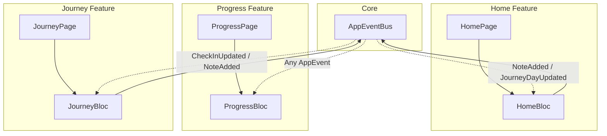

# Cross-Page Real-Time Synchronization Implementation Plan

> **For agentic workers:** REQUIRED SUB-SKILL: Use superpowers:subagent-driven-development to implement this plan task-by-task. Steps use checkbox (`- [ ]`) syntax for tracking.

**Goal:** Implement real-time, bidirectional state synchronization between Home, Journey, and Progress pages via a decoupled in-memory `AppEventBus`, and eliminate direct repository calls from the UI widgets.

**Architecture:** An in-memory broadcast event bus (`AppEventBus`) enables `HomeBloc`, `ProgressBloc`, and `JourneyBloc` to publish domain mutation events and subscribe to relevant updates. When an action occurs on any page, background tabs in `IndexedStack` reload their states immediately and concurrently, while avoiding event loops by restricting event publishing to mutation handlers only.

**Architecture Diagram:**



**Tech Stack:** Flutter, `flutter_bloc`, `get_it`, `injectable`, `freezed`, `mocktail`, `bloc_test`, `dartz`.

**Spec:** [docs/superpowers/specs/2026-10-03-cross-page-realtime-sync-design.md](file:///Users/ahmedsal/workspace/quitra/docs/superpowers/specs/2026-10-03-cross-page-realtime-sync-design.md)

## Global Constraints
- **Strictly Offline:** No network requests, all persistence is local via Isar.
- **Clean Architecture:** Feature-first structure (Domain, Data, Presentation).
- **No Direct Repository Calls in UI:** Widgets must interact only with Blocs.
- **Error Handling:** Return Failures via `Either<Failure, T>` from `dartz`.
- **Code Generation:** Run `dart run build_runner build --delete-conflicting-outputs` whenever `@freezed` or `@injectable` annotations are touched.

---

### Task 1: Core AppEventBus Implementation

**Files:**
- Create: `lib/core/events/app_event_bus.dart`
- Test: `test/core/events/app_event_bus_test.dart`

**Interfaces:**
- Consumes: None
- Produces: `AppEvent`, `CheckInUpdatedEvent`, `NoteAddedEvent`, `JourneyDayUpdatedEvent`, `MilestonesUpdatedEvent`, `AppEventBus` (with `emit`, `stream`, `on<T>()`, and `dispose`).

- [ ] **Step 1: Write the failing test for AppEventBus**

```dart
// test/core/events/app_event_bus_test.dart
import 'package:flutter_test/flutter_test.dart';
import 'package:quitra/core/events/app_event_bus.dart';

void main() {
  late AppEventBus bus;

  setUp(() {
    bus = AppEventBus();
  });

  tearDown(() {
    bus.dispose();
  });

  test('emits and receives events via stream', () async {
    final event = CheckInUpdatedEvent(wasSmoked: false);

    expectLater(bus.stream, emits(event));
    bus.emit(event);
  });

  test('filters events correctly with on<T>()', () async {
    final checkInEvent = CheckInUpdatedEvent(wasSmoked: true);
    final noteEvent = NoteAddedEvent(date: DateTime(2026, 10, 3));

    expectLater(bus.on<CheckInUpdatedEvent>(), emits(checkInEvent));
    bus.emit(noteEvent);
    bus.emit(checkInEvent);
  });
}
```

- [ ] **Step 2: Run test to verify it fails**

Run: `flutter test test/core/events/app_event_bus_test.dart`
Expected: FAIL with compilation error (file not found).

- [ ] **Step 3: Implement AppEventBus**

```dart
// lib/core/events/app_event_bus.dart
import 'dart:async';
import 'package:injectable/injectable.dart';

abstract class AppEvent {
  const AppEvent();
}

class CheckInUpdatedEvent extends AppEvent {
  final bool wasSmoked;
  const CheckInUpdatedEvent({required this.wasSmoked});

  @override
  bool operator ==(Object other) =>
      identical(this, other) ||
      other is CheckInUpdatedEvent && runtimeType == other.runtimeType && wasSmoked == other.wasSmoked;

  @override
  int get hashCode => wasSmoked.hashCode;
}

class NoteAddedEvent extends AppEvent {
  final DateTime date;
  const NoteAddedEvent({required this.date});

  @override
  bool operator ==(Object other) =>
      identical(this, other) ||
      other is NoteAddedEvent && runtimeType == other.runtimeType && date == other.date;

  @override
  int get hashCode => date.hashCode;
}

class JourneyDayUpdatedEvent extends AppEvent {
  final DateTime date;
  const JourneyDayUpdatedEvent({required this.date});

  @override
  bool operator ==(Object other) =>
      identical(this, other) ||
      other is JourneyDayUpdatedEvent && runtimeType == other.runtimeType && date == other.date;

  @override
  int get hashCode => date.hashCode;
}

class MilestonesUpdatedEvent extends AppEvent {
  const MilestonesUpdatedEvent();
}

@lazySingleton
class AppEventBus {
  final StreamController<AppEvent> _controller = StreamController<AppEvent>.broadcast();

  Stream<AppEvent> get stream => _controller.stream;

  Stream<T> on<T extends AppEvent>() {
    return _controller.stream.where((event) => event is T).cast<T>();
  }

  void emit(AppEvent event) {
    if (!_controller.isClosed) {
      _controller.add(event);
    }
  }

  void dispose() {
    _controller.close();
  }
}
```

- [ ] **Step 4: Run test to verify it passes**

Run: `flutter test test/core/events/app_event_bus_test.dart`
Expected: PASS

- [ ] **Step 5: Commit**

```bash
git add lib/core/events/app_event_bus.dart test/core/events/app_event_bus_test.dart
git commit -m "feat(core): implement AppEventBus for reactive cross-page communication"
```

---

### Task 2: GetAllMilestones UseCase

**Files:**
- Create: `lib/features/milestones/domain/usecases/get_all_milestones.dart`
- Test: `test/features/milestones/domain/usecases/get_all_milestones_test.dart`

**Interfaces:**
- Consumes: `MilestoneRepository.getAllMilestones()`
- Produces: `GetAllMilestones` usecase callable via `call()` returning `Future<Either<Failure, List<Milestone>>>`.

- [ ] **Step 1: Write the failing test for GetAllMilestones**

```dart
// test/features/milestones/domain/usecases/get_all_milestones_test.dart
import 'package:dartz/dartz.dart';
import 'package:flutter_test/flutter_test.dart';
import 'package:mocktail/mocktail.dart';
import 'package:quitra/features/milestones/domain/entities/milestone.dart';
import 'package:quitra/features/milestones/domain/repositories/milestone_repository.dart';
import 'package:quitra/features/milestones/domain/usecases/get_all_milestones.dart';

class MockMilestoneRepository extends Mock implements MilestoneRepository {}

void main() {
  late GetAllMilestones useCase;
  late MockMilestoneRepository mockRepository;

  setUp(() {
    mockRepository = MockMilestoneRepository();
    useCase = GetAllMilestones(mockRepository);
  });

  test('calls repository.getAllMilestones and returns list of milestones', () async {
    final milestones = <Milestone>[];
    when(() => mockRepository.getAllMilestones()).thenAnswer((_) async => Right(milestones));

    final result = await useCase();

    expect(result, Right(milestones));
    verify(() => mockRepository.getAllMilestones()).called(1);
  });
}
```

- [ ] **Step 2: Run test to verify it fails**

Run: `flutter test test/features/milestones/domain/usecases/get_all_milestones_test.dart`
Expected: FAIL with compilation error (file not found).

- [ ] **Step 3: Implement GetAllMilestones**

```dart
// lib/features/milestones/domain/usecases/get_all_milestones.dart
import 'package:dartz/dartz.dart';
import 'package:injectable/injectable.dart';
import '../../../../core/error/failures.dart';
import '../entities/milestone.dart';
import '../repositories/milestone_repository.dart';

@lazySingleton
class GetAllMilestones {
  final MilestoneRepository repository;

  GetAllMilestones(this.repository);

  Future<Either<Failure, List<Milestone>>> call() {
    return repository.getAllMilestones();
  }
}
```

- [ ] **Step 4: Run test to verify it passes**

Run: `flutter test test/features/milestones/domain/usecases/get_all_milestones_test.dart`
Expected: PASS

- [ ] **Step 5: Commit**

```bash
git add lib/features/milestones/domain/usecases/get_all_milestones.dart test/features/milestones/domain/usecases/get_all_milestones_test.dart
git commit -m "feat(milestones): add GetAllMilestones use case"
```

---

### Task 3: ProgressBloc & ProgressState Integration

**Files:**
- Modify: `lib/features/progress/presentation/bloc/progress_state.dart`
- Modify: `lib/features/progress/presentation/bloc/progress_bloc.dart`
- Create: `test/features/progress/presentation/bloc/progress_bloc_test.dart`

**Interfaces:**
- Consumes: `AppEventBus`, `GetProgressStats`, `GetAllMilestones`
- Produces: `ProgressState.loaded(ProgressStats stats, List<Milestone> milestones)`

- [ ] **Step 1: Update ProgressState to include milestones**

In `lib/features/progress/presentation/bloc/progress_state.dart`:
```dart
import 'package:freezed_annotation/freezed_annotation.dart';
import '../../domain/entities/progress_stats.dart';
import '../../../milestones/domain/entities/milestone.dart';

part 'progress_state.freezed.dart';

@freezed
abstract class ProgressState with _$ProgressState {
  const factory ProgressState.initial() = Initial;
  const factory ProgressState.loading() = Loading;
  const factory ProgressState.loaded({
    required ProgressStats stats,
    @Default([]) List<Milestone> milestones,
  }) = Loaded;
  const factory ProgressState.error(String message) = Error;
}
```

- [ ] **Step 2: Write failing tests for ProgressBloc**

```dart
// test/features/progress/presentation/bloc/progress_bloc_test.dart
import 'package:dartz/dartz.dart';
import 'package:flutter_test/flutter_test.dart';
import 'package:mocktail/mocktail.dart';
import 'package:quitra/core/events/app_event_bus.dart';
import 'package:quitra/features/milestones/domain/entities/milestone.dart';
import 'package:quitra/features/milestones/domain/usecases/get_all_milestones.dart';
import 'package:quitra/features/progress/domain/entities/progress_stats.dart';
import 'package:quitra/features/progress/domain/usecases/get_progress_stats.dart';
import 'package:quitra/features/progress/presentation/bloc/progress_bloc.dart';
import 'package:quitra/features/progress/presentation/bloc/progress_event.dart';
import 'package:quitra/features/progress/presentation/bloc/progress_state.dart';

class MockGetProgressStats extends Mock implements GetProgressStats {}
class MockGetAllMilestones extends Mock implements GetAllMilestones {}

void main() {
  late ProgressBloc bloc;
  late MockGetProgressStats mockGetProgressStats;
  late MockGetAllMilestones mockGetAllMilestones;
  late AppEventBus appEventBus;

  const mockStats = ProgressStats(
    heartRateProgress: 0.5,
    circulationProgress: 0.6,
    lungFunctionProgress: 0.7,
    moneySaved: 100.0,
    cigarettesAvoided: 50,
    lifeRegainedMinutes: 550,
    currentStreak: 5,
  );

  final mockMilestones = [
    Milestone(
      id: '1',
      titleKey: 'day1',
      descriptionKey: 'day1_desc',
      category: MilestoneCategory.time,
      isUnlocked: true,
      targetValue: 1,
    ),
  ];

  setUp(() {
    mockGetProgressStats = MockGetProgressStats();
    mockGetAllMilestones = MockGetAllMilestones();
    appEventBus = AppEventBus();

    when(() => mockGetProgressStats()).thenAnswer((_) async => const Right(mockStats));
    when(() => mockGetAllMilestones()).thenAnswer((_) async => Right(mockMilestones));

    bloc = ProgressBloc(mockGetProgressStats, mockGetAllMilestones, appEventBus);
  });

  tearDown(() {
    bloc.close();
    appEventBus.dispose();
  });

  test('initial state is ProgressState.initial()', () {
    expect(bloc.state, const ProgressState.initial());
  });

  test('LoadProgress loads stats and milestones into Loaded state', () async {
    final expectedStates = [
      const ProgressState.loading(),
      ProgressState.loaded(stats: mockStats, milestones: mockMilestones),
    ];

    expectLater(bloc.stream, emitsInOrder(expectedStates));
    bloc.add(const ProgressEvent.loadProgress());
  });

  test('AppEventBus emission triggers automatic LoadProgress reload', () async {
    final expectedStates = [
      const ProgressState.loading(),
      ProgressState.loaded(stats: mockStats, milestones: mockMilestones),
    ];

    expectLater(bloc.stream, emitsInOrder(expectedStates));
    appEventBus.emit(const CheckInUpdatedEvent(wasSmoked: false));
  });
}
```

- [ ] **Step 3: Update ProgressBloc implementation**

In `lib/features/progress/presentation/bloc/progress_bloc.dart`:
```dart
import 'dart:async';
import 'package:flutter_bloc/flutter_bloc.dart';
import 'package:injectable/injectable.dart';
import '../../../../core/events/app_event_bus.dart';
import '../../../milestones/domain/usecases/get_all_milestones.dart';
import '../../domain/usecases/get_progress_stats.dart';
import 'progress_event.dart';
import 'progress_state.dart';

@injectable
class ProgressBloc extends Bloc<ProgressEvent, ProgressState> {
  final GetProgressStats getProgressStats;
  final GetAllMilestones getAllMilestones;
  final AppEventBus appEventBus;
  StreamSubscription<AppEvent>? _busSubscription;

  ProgressBloc(
    this.getProgressStats,
    this.getAllMilestones,
    this.appEventBus,
  ) : super(const ProgressState.initial()) {
    on<LoadProgress>(_onLoadProgress);

    _busSubscription = appEventBus.stream.listen((_) {
      add(const ProgressEvent.loadProgress());
    });
  }

  Future<void> _onLoadProgress(
    LoadProgress event,
    Emitter<ProgressState> emit,
  ) async {
    emit(const ProgressState.loading());

    final statsResult = await getProgressStats();
    final milestonesResult = await getAllMilestones();

    statsResult.fold(
      (failure) => emit(ProgressState.error(failure.toString())),
      (stats) {
        final milestones = milestonesResult.getOrElse(() => []);
        emit(ProgressState.loaded(stats: stats, milestones: milestones));
      },
    );
  }

  @override
  Future<void> close() {
    _busSubscription?.cancel();
    return super.close();
  }
}
```

- [ ] **Step 4: Run build_runner and verify tests pass**

Run:
```bash
dart run build_runner build --delete-conflicting-outputs
flutter test test/features/progress/presentation/bloc/progress_bloc_test.dart
```
Expected: PASS

- [ ] **Step 5: Commit**

```bash
git add lib/features/progress/presentation/bloc/ test/features/progress/presentation/bloc/
git commit -m "feat(progress): update ProgressBloc with AppEventBus listening and milestone state"
```

---

### Task 4: JourneyBloc & JourneyState Integration

**Files:**
- Modify: `lib/features/journey/presentation/bloc/journey_state.dart`
- Modify: `lib/features/journey/presentation/bloc/journey_bloc.dart`
- Create: `test/features/journey/presentation/bloc/journey_bloc_test.dart`

**Interfaces:**
- Consumes: `AppEventBus`, `GetJourneyHistory`, `UpdateJourneyDay`, `AddJourneyNote`, `GetAllMilestones`
- Produces: `JourneyState.loaded(List<JourneyDay> history, List<Milestone> milestones)`

- [ ] **Step 1: Update JourneyState to include milestones**

In `lib/features/journey/presentation/bloc/journey_state.dart`:
```dart
import 'package:freezed_annotation/freezed_annotation.dart';
import '../../domain/entities/journey_day.dart';
import '../../../milestones/domain/entities/milestone.dart';

part 'journey_state.freezed.dart';

@freezed
abstract class JourneyState with _$JourneyState {
  const factory JourneyState.initial() = _Initial;
  const factory JourneyState.loading() = _Loading;
  const factory JourneyState.loaded({
    required List<JourneyDay> history,
    @Default([]) List<Milestone> milestones,
  }) = _Loaded;
  const factory JourneyState.error(String message) = _Error;
}
```

- [ ] **Step 2: Write failing tests for JourneyBloc**

```dart
// test/features/journey/presentation/bloc/journey_bloc_test.dart
import 'package:dartz/dartz.dart';
import 'package:flutter_test/flutter_test.dart';
import 'package:mocktail/mocktail.dart';
import 'package:quitra/core/events/app_event_bus.dart';
import 'package:quitra/features/journey/domain/entities/journey_day.dart';
import 'package:quitra/features/journey/domain/usecases/add_journey_note.dart';
import 'package:quitra/features/journey/domain/usecases/get_journey_history.dart';
import 'package:quitra/features/journey/domain/usecases/update_journey_day.dart';
import 'package:quitra/features/journey/presentation/bloc/journey_bloc.dart';
import 'package:quitra/features/journey/presentation/bloc/journey_event.dart';
import 'package:quitra/features/journey/presentation/bloc/journey_state.dart';
import 'package:quitra/features/milestones/domain/entities/milestone.dart';
import 'package:quitra/features/milestones/domain/usecases/get_all_milestones.dart';

class MockGetJourneyHistory extends Mock implements GetJourneyHistory {}
class MockUpdateJourneyDay extends Mock implements UpdateJourneyDay {}
class MockAddJourneyNote extends Mock implements AddJourneyNote {}
class MockGetAllMilestones extends Mock implements GetAllMilestones {}

void main() {
  late JourneyBloc bloc;
  late MockGetJourneyHistory mockGetJourneyHistory;
  late MockUpdateJourneyDay mockUpdateJourneyDay;
  late MockAddJourneyNote mockAddJourneyNote;
  late MockGetAllMilestones mockGetAllMilestones;
  late AppEventBus appEventBus;

  final mockHistory = [
    JourneyDay(
      date: DateTime(2026, 10, 3),
      wasSmoked: false,
      cravingLevel: 1,
    ),
  ];

  final mockMilestones = [
    Milestone(
      id: 'm1',
      titleKey: 'title',
      descriptionKey: 'desc',
      category: MilestoneCategory.strength,
      isUnlocked: true,
      targetValue: 1,
    ),
  ];

  setUp(() {
    mockGetJourneyHistory = MockGetJourneyHistory();
    mockUpdateJourneyDay = MockUpdateJourneyDay();
    mockAddJourneyNote = MockAddJourneyNote();
    mockGetAllMilestones = MockGetAllMilestones();
    appEventBus = AppEventBus();

    when(() => mockGetJourneyHistory()).thenAnswer((_) async => Right(mockHistory));
    when(() => mockGetAllMilestones()).thenAnswer((_) async => Right(mockMilestones));

    bloc = JourneyBloc(
      mockGetJourneyHistory,
      mockUpdateJourneyDay,
      mockAddJourneyNote,
      mockGetAllMilestones,
      appEventBus,
    );
  });

  tearDown(() {
    bloc.close();
    appEventBus.dispose();
  });

  test('initial state is JourneyState.initial()', () {
    expect(bloc.state, const JourneyState.initial());
  });

  test('LoadHistory loads history and milestones into Loaded state', () async {
    final expectedStates = [
      const JourneyState.loading(),
      JourneyState.loaded(history: mockHistory, milestones: mockMilestones),
    ];

    expectLater(bloc.stream, emitsInOrder(expectedStates));
    bloc.add(const JourneyEvent.loadHistory());
  });

  test('CheckInUpdatedEvent on AppEventBus triggers automatic LoadHistory reload', () async {
    final expectedStates = [
      const JourneyState.loading(),
      JourneyState.loaded(history: mockHistory, milestones: mockMilestones),
    ];

    expectLater(bloc.stream, emitsInOrder(expectedStates));
    appEventBus.emit(const CheckInUpdatedEvent(wasSmoked: false));
  });

  test('UpdateDay emits JourneyDayUpdatedEvent to AppEventBus', () async {
    registerFallbackValue(
      UpdateJourneyDayParams(date: DateTime(2026, 10, 3)),
    );
    when(() => mockUpdateJourneyDay(any())).thenAnswer((_) async => const Right(unit));

    expectLater(
      appEventBus.on<JourneyDayUpdatedEvent>(),
      emits(predicate<JourneyDayUpdatedEvent>((e) => e.date == DateTime(2026, 10, 3))),
    );

    bloc.add(JourneyEvent.updateDay(date: DateTime(2026, 10, 3), wasSmoked: false));
  });
}
```

- [ ] **Step 3: Update JourneyBloc implementation**

In `lib/features/journey/presentation/bloc/journey_bloc.dart`:
```dart
import 'dart:async';
import 'package:flutter_bloc/flutter_bloc.dart';
import 'package:injectable/injectable.dart';

import '../../../../core/events/app_event_bus.dart';
import '../../../milestones/domain/usecases/get_all_milestones.dart';
import '../../domain/usecases/add_journey_note.dart';
import '../../domain/usecases/get_journey_history.dart';
import '../../domain/usecases/update_journey_day.dart';
import 'journey_event.dart';
import 'journey_state.dart';

@injectable
class JourneyBloc extends Bloc<JourneyEvent, JourneyState> {
  final GetJourneyHistory getJourneyHistory;
  final UpdateJourneyDay updateJourneyDay;
  final AddJourneyNote addJourneyNote;
  final GetAllMilestones getAllMilestones;
  final AppEventBus appEventBus;
  StreamSubscription<AppEvent>? _busSubscription;

  JourneyBloc(
    this.getJourneyHistory,
    this.updateJourneyDay,
    this.addJourneyNote,
    this.getAllMilestones,
    this.appEventBus,
  ) : super(const JourneyState.initial()) {
    on<LoadHistory>(_onLoadHistory);
    on<UpdateDay>(_onUpdateDay);
    on<AddNote>(_onAddNote);

    _busSubscription = appEventBus.stream.listen((event) {
      if (event is CheckInUpdatedEvent || event is NoteAddedEvent) {
        add(const JourneyEvent.loadHistory());
      }
    });
  }

  Future<void> _onLoadHistory(
    LoadHistory event,
    Emitter<JourneyState> emit,
  ) async {
    emit(const JourneyState.loading());
    final result = await getJourneyHistory();
    final milestonesResult = await getAllMilestones();

    result.fold(
      (failure) => emit(const JourneyState.error('Failed to load history')),
      (history) {
        final milestones = milestonesResult.getOrElse(() => []);
        emit(JourneyState.loaded(history: history, milestones: milestones));
      },
    );
  }

  Future<void> _onUpdateDay(
    UpdateDay event,
    Emitter<JourneyState> emit,
  ) async {
    final result = await updateJourneyDay(UpdateJourneyDayParams(
      date: event.date,
      wasSmoked: event.wasSmoked,
      cravingLevel: event.cravingLevel,
      note: event.note,
    ));

    result.fold(
      (failure) => emit(const JourneyState.error('Failed to update day')),
      (_) {
        appEventBus.emit(JourneyDayUpdatedEvent(date: event.date));
        add(const JourneyEvent.loadHistory());
      },
    );
  }

  Future<void> _onAddNote(
    AddNote event,
    Emitter<JourneyState> emit,
  ) async {
    final result = await addJourneyNote(AddJourneyNoteParams(
      date: event.date,
      text: event.text,
    ));

    result.fold(
      (failure) => emit(const JourneyState.error('Failed to add note')),
      (_) {
        appEventBus.emit(NoteAddedEvent(date: event.date));
        add(const JourneyEvent.loadHistory());
      },
    );
  }

  @override
  Future<void> close() {
    _busSubscription?.cancel();
    return super.close();
  }
}
```

- [ ] **Step 4: Run build_runner and verify tests pass**

Run:
```bash
dart run build_runner build --delete-conflicting-outputs
flutter test test/features/journey/presentation/bloc/journey_bloc_test.dart
```
Expected: PASS

- [ ] **Step 5: Commit**

```bash
git add lib/features/journey/presentation/bloc/ test/features/journey/presentation/bloc/
git commit -m "feat(journey): update JourneyBloc with AppEventBus synchronization and milestone state"
```

---

### Task 5: HomeBloc & HomeState Integration

**Files:**
- Modify: `lib/features/home/presentation/bloc/home_state.dart`
- Modify: `lib/features/home/presentation/bloc/home_bloc.dart`
- Modify: `test/features/home/presentation/bloc/home_bloc_test.dart`

**Interfaces:**
- Consumes: `AppEventBus`, `GetJourneyHistory`, `GetHomeStatsUseCase`, `LogCravingUseCase`, `SaveDailyLog`, `GetStreak`, `ProcessCheckIn`, `CheckMilestones`, `GetTodayCheckInStatus`
- Produces: `HomeState.loaded(stats, streak, journeyHistory, newlyUnlockedMilestone, todayStatus)` and emits `CheckInUpdatedEvent`, `NoteAddedEvent` to `AppEventBus`.

- [ ] **Step 1: Update HomeState to include journeyHistory**

In `lib/features/home/presentation/bloc/home_state.dart`:
```dart
import 'package:freezed_annotation/freezed_annotation.dart';
import '../../domain/entities/today_check_in_status.dart';
import '../../domain/entities/user_stats.dart';
import '../../../streak/domain/entities/streak.dart';
import '../../../milestones/domain/entities/milestone.dart';
import '../../../journey/domain/entities/journey_day.dart';

part 'home_state.freezed.dart';

@freezed
abstract class HomeState with _$HomeState {
  const factory HomeState.initial() = Initial;
  const factory HomeState.loading() = Loading;
  const factory HomeState.loaded({
    required UserStats stats,
    required Streak streak,
    @Default([]) List<JourneyDay> journeyHistory,
    Milestone? newlyUnlockedMilestone,
    TodayCheckInStatus? todayStatus,
  }) = Loaded;
  const factory HomeState.error(String message) = Error;
}
```

- [ ] **Step 2: Update HomeBloc tests with AppEventBus & GetJourneyHistory**

In `test/features/home/presentation/bloc/home_bloc_test.dart`:
- Add `MockGetJourneyHistory` and `AppEventBus`.
- Pass to `HomeBloc` constructor.
- Add test verifying `SaveDailyCheckIn` emits `CheckInUpdatedEvent`.
- Add test verifying `AppendNote` emits `NoteAddedEvent`.
- Add test verifying `LogCraving` emits `CheckInUpdatedEvent`.
- Add test verifying `JourneyDayUpdatedEvent` on `AppEventBus` triggers `loadStats()`.

- [ ] **Step 3: Update HomeBloc implementation**

In `lib/features/home/presentation/bloc/home_bloc.dart`:
```dart
import 'dart:async';
import 'package:flutter_bloc/flutter_bloc.dart';
import 'package:injectable/injectable.dart';
import '../../../../core/events/app_event_bus.dart';
import '../../../journey/domain/usecases/get_journey_history.dart';
import '../../domain/entities/today_check_in_status.dart';
import '../../domain/usecases/get_home_stats_usecase.dart';
import '../../domain/usecases/get_today_check_in_status.dart';
import '../../domain/usecases/log_craving_usecase.dart';
import '../../domain/usecases/save_daily_log.dart';
import '../../../streak/domain/usecases/get_streak.dart';
import '../../../streak/domain/usecases/process_check_in.dart';
import '../../../milestones/domain/usecases/check_milestones.dart';
import '../../../milestones/domain/entities/milestone.dart';
import 'home_event.dart';
import 'home_state.dart';

@injectable
class HomeBloc extends Bloc<HomeEvent, HomeState> {
  final GetHomeStatsUseCase getHomeStatsUseCase;
  final LogCravingUseCase logCravingUseCase;
  final SaveDailyLog saveDailyLog;
  final GetStreak getStreak;
  final ProcessCheckIn processCheckIn;
  final CheckMilestones checkMilestones;
  final GetTodayCheckInStatus getTodayCheckInStatus;
  final GetJourneyHistory getJourneyHistory;
  final AppEventBus appEventBus;
  StreamSubscription<AppEvent>? _busSubscription;

  HomeBloc(
    this.getHomeStatsUseCase,
    this.logCravingUseCase,
    this.saveDailyLog,
    this.getStreak,
    this.processCheckIn,
    this.checkMilestones,
    this.getTodayCheckInStatus,
    this.getJourneyHistory,
    this.appEventBus,
  ) : super(const HomeState.initial()) {
    on<LoadStats>(_onLoadStats);
    on<LogCraving>(_onLogCraving);
    on<SaveDailyCheckIn>(_onSaveDailyCheckIn);
    on<AppendNote>(_onAppendNote);

    _busSubscription = appEventBus.stream.listen((event) {
      if (event is JourneyDayUpdatedEvent || event is NoteAddedEvent) {
        add(const HomeEvent.loadStats());
      }
    });
  }

  Future<void> _onLoadStats(LoadStats event, Emitter<HomeState> emit) async {
    emit(const HomeState.loading());
    final statsResult = await getHomeStatsUseCase();
    final streakResult = await getStreak();
    final todayStatusResult = await getTodayCheckInStatus();
    final historyResult = await getJourneyHistory();
    final history = historyResult.getOrElse(() => []);

    final todayStatus = todayStatusResult.getOrElse(() => const TodayCheckInStatus(
          hasCheckedIn: false,
          wasSmoked: false,
          cravingLevel: 1,
          notesCount: 0,
        ));

    statsResult.fold(
      (failure) => emit(const HomeState.error('Failed to load stats')),
      (stats) {
        streakResult.fold(
          (failure) => emit(const HomeState.error('Failed to load streak')),
          (streak) => emit(HomeState.loaded(
            stats: stats,
            streak: streak,
            journeyHistory: history,
            todayStatus: todayStatus,
          )),
        );
      },
    );
  }

  Future<void> _onLogCraving(LogCraving event, Emitter<HomeState> emit) async {
    await logCravingUseCase(wasSmoked: event.wasSmoked);
    if (event.wasSmoked) {
      await processCheckIn(wasSmoked: true);
    }
    appEventBus.emit(CheckInUpdatedEvent(wasSmoked: event.wasSmoked));
    add(const HomeEvent.loadStats());
  }

  Future<void> _onSaveDailyCheckIn(
    SaveDailyCheckIn event,
    Emitter<HomeState> emit,
  ) async {
    await saveDailyLog(
      SaveDailyLogParams(
        wasSmoked: event.wasSmoked,
        cravingLevel: event.cravingLevel,
        note: event.note,
      ),
    );
    await processCheckIn(wasSmoked: event.wasSmoked);

    final statsResult = await getHomeStatsUseCase();
    final streakResult = await getStreak();
    final todayStatusResult = await getTodayCheckInStatus();
    final historyResult = await getJourneyHistory();
    final history = historyResult.getOrElse(() => []);
    final todayStatus = todayStatusResult.fold((_) => null, (status) => status);

    if (statsResult.isRight() && streakResult.isRight()) {
      final stats = statsResult.getOrElse(() => throw Exception());
      final streak = streakResult.getOrElse(() => throw Exception());

      Milestone? unlockedMilestone;
      final checkResult = await checkMilestones(
        daysSmokeFree: stats.daysSmokeFree,
        moneySaved: stats.moneySaved,
        currentStreak: streak.currentCount,
        cravingsResisted: 0,
        totalCheckIns: stats.daysSmokeFree,
        heartProgress: 0.0,
        circulationProgress: 0.0,
        lungProgress: 0.0,
      );

      checkResult.fold((_) {}, (unlockedList) {
        if (unlockedList.isNotEmpty) {
          unlockedMilestone = unlockedList.first;
        }
      });

      emit(HomeState.loaded(
        stats: stats,
        streak: streak,
        journeyHistory: history,
        newlyUnlockedMilestone: unlockedMilestone,
        todayStatus: todayStatus,
      ));
      appEventBus.emit(CheckInUpdatedEvent(wasSmoked: event.wasSmoked));
      return;
    }

    appEventBus.emit(CheckInUpdatedEvent(wasSmoked: event.wasSmoked));
    add(const HomeEvent.loadStats());
  }

  Future<void> _onAppendNote(
    AppendNote event,
    Emitter<HomeState> emit,
  ) async {
    final todayStatusResult = await getTodayCheckInStatus();
    final todayStatus = todayStatusResult.fold(
      (_) => null,
      (status) => status,
    );

    await saveDailyLog(
      SaveDailyLogParams(
        wasSmoked: todayStatus?.wasSmoked ?? false,
        cravingLevel: todayStatus?.cravingLevel ?? 1,
        note: event.note,
      ),
    );

    appEventBus.emit(NoteAddedEvent(date: DateTime.now()));
    add(const HomeEvent.loadStats());
  }

  @override
  Future<void> close() {
    _busSubscription?.cancel();
    return super.close();
  }
}
```

- [ ] **Step 4: Run build_runner and verify tests pass**

Run:
```bash
dart run build_runner build --delete-conflicting-outputs
flutter test test/features/home/presentation/bloc/home_bloc_test.dart
```
Expected: PASS

- [ ] **Step 5: Commit**

```bash
git add lib/features/home/presentation/bloc/ test/features/home/presentation/bloc/
git commit -m "feat(home): integrate AppEventBus and journeyHistory in HomeBloc"
```

---

### Task 6: UI Refactor & Direct Repository Removal

**Files:**
- Modify: `lib/features/home/presentation/pages/home_page.dart`
- Modify: `lib/features/progress/presentation/pages/progress_page.dart`
- Modify: `lib/features/journey/presentation/pages/journey_page.dart`

**Interfaces:**
- Consumes: `HomeBloc`, `ProgressBloc`, `JourneyBloc` states
- Produces: Clean UI views with 0 direct `getIt<...Repository>()` calls.

- [ ] **Step 1: Refactor HomePage to consume journeyHistory from HomeState**

In `lib/features/home/presentation/pages/home_page.dart`:
- Remove `_loadJourneyHistory()` and `_history` state.
- Pass `state.journeyHistory` directly to `StreakHeroCard`.
- Keep `MilestoneUnlockSheet.show(context, state.newlyUnlockedMilestone!)` in the listener.

- [ ] **Step 2: Refactor ProgressPage to consume milestones from ProgressState**

In `lib/features/progress/presentation/pages/progress_page.dart`:
- Convert `ProgressPage` to a clean widget without `_loadMilestones()` or `getIt<MilestoneRepository>()`.
- In `_ProgressPageContent`, obtain `milestones` from `state.milestones` when `state is Loaded`.

- [ ] **Step 3: Refactor JourneyPage to consume milestones from JourneyState**

In `lib/features/journey/presentation/pages/journey_page.dart`:
- Convert `JourneyPage` to a clean widget without `_loadMilestones()` or `getIt<MilestoneRepository>()`.
- In `_JourneyView`, read `milestones` and `history` from `JourneyState`.

- [ ] **Step 4: Verify all page widget tests pass**

Run: `flutter test test/features/`
Expected: PASS

- [ ] **Step 5: Commit**

```bash
git add lib/features/home/presentation/pages/home_page.dart lib/features/progress/presentation/pages/progress_page.dart lib/features/journey/presentation/pages/journey_page.dart
git commit -m "refactor(presentation): remove direct repository calls and bind states from Blocs"
```

---

### Task 7: Full System Verification & Code Generation

**Files:**
- Generated: `lib/core/di/injection.config.dart` and `*.freezed.dart`

- [ ] **Step 1: Run full code generation**

Run: `dart run build_runner build --delete-conflicting-outputs`
Expected: Succeeded with 0 conflicting outputs.

- [ ] **Step 2: Run Flutter Analyze**

Run: `flutter analyze`
Expected: 0 errors, 0 warnings.

- [ ] **Step 3: Run Full Test Suite**

Run: `flutter test`
Expected: All tests pass.

- [ ] **Step 4: Commit any generated changes and finalize**

```bash
git add lib/
git commit -m "chore: regenerate DI and freezed files for real-time synchronization"
```
