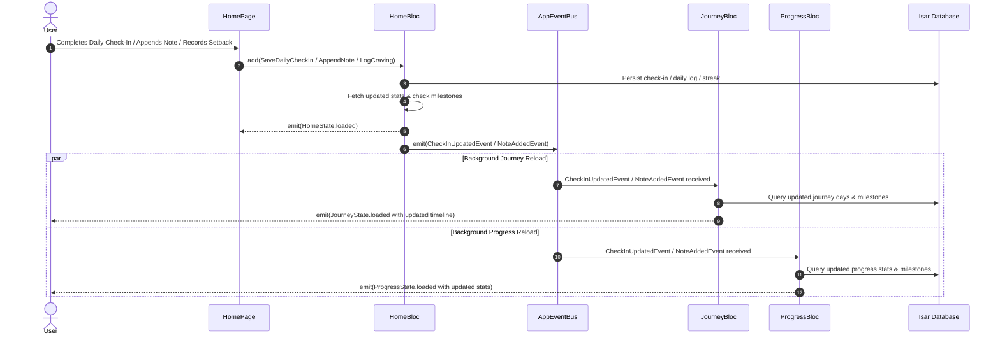

# Cross-Page Real-Time Synchronization Design Specification

## 1. Overview
When a user takes any action in the Quitra Home page (such as logging a daily check-in, appending a quick note, recording a craving, or reporting a setback), the updated state must reflect immediately on both the Journey page and Progress page. Furthermore, any action taken on the Journey page (such as updating a previous day or adding a note) must also reflect back onto the Home and Progress pages in real-time.

This document specifies the architecture, components, and data flow to achieve decoupled, bidirectional synchronization while strictly adhering to Quitra's Clean Architecture, offline-only Isar storage, and "No Direct Repository Calls in UI" constraints.

---

## 2. Architectural Analysis & Problem Definition

### 2.1 Current State
- `MainPage` mounts `HomePage`, `ProgressPage`, `JourneyPage`, and `SettingsPage` within an `IndexedStack`.
- `IndexedStack` maintains the state of each page once created.
- Each page initializes its own Bloc (`HomeBloc`, `ProgressBloc`, `JourneyBloc`) in its top-level widget build method.
- Mutations made via `HomeBloc` persist changes to Isar, but `ProgressBloc` and `JourneyBloc` have no mechanism to know that local data has changed while remaining mounted in `IndexedStack`.
- Both `ProgressPage` and `JourneyPage` directly call `getIt<MilestoneRepository>().getAllMilestones()` within their respective `State.initState()` methods, violating Quitra's rule: *"No Direct Repository Calls in UI: Widgets must only interact with Blocs."*

### 2.2 Goals
1. **Instant, Zero-Lag Reflection:** Tapping into Journey or Progress after an action on Home shows updated calculations, timeline items, and milestones immediately.
2. **Bidirectional Reactivity:** Mutations originating on the Journey page synchronize back to Home and Progress.
3. **Decoupled Architecture:** Blocs do not depend directly on each other; coordination is mediated via an in-memory event bus.
4. **Clean Architecture Adherence:** Eliminates direct UI repository calls for milestone loading by integrating them into the presentation layer states/use cases.
5. **No Event Loops:** Clear separation between state mutation handlers (which publish events) and state reload handlers (which only query and emit states).

---

## 3. Core Components

### 3.1 AppEventBus (`lib/core/events/app_event_bus.dart`)
A lightweight, typed in-memory event bus registered as a lazy singleton in `getIt`:

```dart
abstract class AppEvent {
  const AppEvent();
}

class CheckInUpdatedEvent extends AppEvent {
  final bool wasSmoked;
  const CheckInUpdatedEvent({required this.wasSmoked});
}

class NoteAddedEvent extends AppEvent {
  final DateTime date;
  const NoteAddedEvent({required this.date});
}

class JourneyDayUpdatedEvent extends AppEvent {
  final DateTime date;
  const JourneyDayUpdatedEvent({required this.date});
}

class MilestonesUpdatedEvent extends AppEvent {
  const MilestonesUpdatedEvent();
}

@lazySingleton
class AppEventBus {
  final StreamController<AppEvent> _controller = StreamController<AppEvent>.broadcast();

  Stream<AppEvent> get stream => _controller.stream;

  Stream<T> on<T extends AppEvent>() {
    return _controller.stream.where((event) => event is T).cast<T>();
  }

  void emit(AppEvent event) {
    if (!_controller.isClosed) {
      _controller.add(event);
    }
  }

  void dispose() {
    _controller.close();
  }
}
```

### 3.2 Feature Blocs Integration

#### 3.2.1 `HomeBloc` (`lib/features/home/presentation/bloc/home_bloc.dart`)
- **Dependencies:** Injects `AppEventBus`.
- **Publisher Role:**
  - After `_onSaveDailyCheckIn`: emits `CheckInUpdatedEvent(wasSmoked: event.wasSmoked)`.
  - After `_onLogCraving`: emits `CheckInUpdatedEvent(wasSmoked: event.wasSmoked)`.
  - After `_onAppendNote`: emits `NoteAddedEvent(date: DateTime.now())`.
- **Subscriber Role:**
  - Subscribes to `appEventBus.on<JourneyDayUpdatedEvent>()` and `appEventBus.on<NoteAddedEvent>()`.
  - Triggers `add(const HomeEvent.loadStats())` upon receiving these events.
- **Lifecycle:** Cancels subscriptions on `close()`.

#### 3.2.2 `ProgressBloc` (`lib/features/progress/presentation/bloc/progress_bloc.dart`)
- **Dependencies:** Injects `AppEventBus` and `MilestoneRepository` (or `GetMilestonesUseCase`).
- **State Change:** `ProgressState.loaded` includes `ProgressStats stats` and `List<Milestone> milestones`.
- **Subscriber Role:**
  - Subscribes to `appEventBus.stream`.
  - Any check-in update, note update, or journey day change triggers `add(const ProgressEvent.loadProgress())`.
- **UI Update (`ProgressPage`):** Removes `_loadMilestones()` from `_ProgressPageState` and reads milestones directly from `ProgressState.loaded`.
- **Lifecycle:** Cancels subscription on `close()`.

#### 3.2.3 `JourneyBloc` (`lib/features/journey/presentation/bloc/journey_bloc.dart`)
- **Dependencies:** Injects `AppEventBus` and `MilestoneRepository` (or `GetMilestonesUseCase`).
- **State Change:** `JourneyState.loaded` includes `List<JourneyDay> history` and `List<Milestone> milestones`.
- **Publisher Role:**
  - After `_onUpdateDay`: emits `JourneyDayUpdatedEvent(date: event.date)`.
  - After `_onAddNote`: emits `NoteAddedEvent(date: event.date)`.
- **Subscriber Role:**
  - Subscribes to `appEventBus.on<CheckInUpdatedEvent>()` and `appEventBus.on<NoteAddedEvent>()`.
  - Triggers `add(const JourneyEvent.loadHistory())`.
- **UI Update (`JourneyPage`):** Removes `_loadMilestones()` from `_JourneyPageState` and reads milestones directly from `JourneyState.loaded`.
- **Lifecycle:** Cancels subscriptions on `close()`.

---

## 4. Sequence & Data Flow



---

## 5. Concurrency & Safety Considerations
1. **Loop Prevention:** Events are exclusively emitted from user-action handlers (`SaveDailyCheckIn`, `AppendNote`, `LogCraving`, `UpdateDay`, `AddNote`). Read-only query handlers (`LoadStats`, `LoadProgress`, `LoadHistory`) NEVER emit events to `AppEventBus`.
2. **Cancellation on Close:** Each Bloc holds its stream subscriptions as private fields and cancels them inside their overridden `Future<void> close()` methods.
3. **No Direct UI Repository Calls:** Milestone loading in both `ProgressPage` and `JourneyPage` is encapsulated inside their respective Blocs.

---

## 6. Testing & Validation Plan
1. **Unit Tests:**
   - `test/core/events/app_event_bus_test.dart`: Test broadcasting, specific event filtering with `on<T>()`, and proper disposal.
   - `test/features/home/presentation/bloc/home_bloc_test.dart`: Test event emissions on check-in, craving, note; test stats reload on external events.
   - `test/features/progress/presentation/bloc/progress_bloc_test.dart`: Test stats & milestone loading, and reload triggering upon `AppEvent`.
   - `test/features/journey/presentation/bloc/journey_bloc_test.dart`: Test history & milestone loading, mutation event emissions, and reload on `AppEvent`.
2. **Static Analysis & Build Runner:**
   - Execute `dart run build_runner build --delete-conflicting-outputs` to regenerate Freezed and Injectable files.
   - Execute `flutter analyze` ensuring 0 warnings/errors.
   - Execute `flutter test` verifying all test suites pass.
